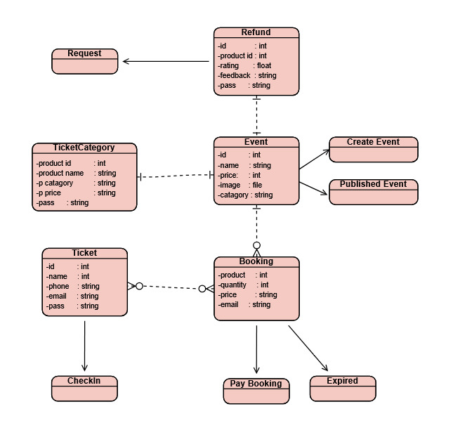

Event Ticketing & Booking System

Institut Teknologi Sepuluh Nopember (ITS) Departemen Teknik Informatika Course: Software Construction (EF234402)

Submitted by: 

    Azka Fauziyah (NRP: 5053241020)
    Berlian Yafi Kania Mu'awanah (NRP: 5053241046)

1. Project Overview

This repository contains the implementation of the Event Ticketing & Booking System. The software architecture strictly adheres to Clean Architecture principles and Domain-Driven Design (DDD) tactical patterns, ensuring clear separation of concerns across the Domain, Application, Infrastructure, and Presentation layers.
2. Configuration & Execution
2.1. PostgreSQL Database Configuration

The system utilizes Entity Framework Core with PostgreSQL for data persistence.

    Ensure a PostgreSQL server is running locally or remotely.

    Locate the configuration file at Ticketing.WebAPI/appsettings.json.

    Update the DefaultConnection string with the appropriate host, database name, and credentials:

JSON

"ConnectionStrings": {
  "DefaultConnection": "Host=localhost;Database=EventTicketingDb;Username=postgres;Password=YourSecurePassword"
}

Clean Architecture Diagram

2.2. Executing Database Migrations

To instantiate the database schema using EF Core Code-First migrations, execute the following command from the root solution directory:
Bash

dotnet ef database update --project Ticketing.Infrastructure --startup-project Ticketing.WebAPI

2.3. Running the Application

Once the database is provisioned, the REST API can be initiated:

    Navigate to the Presentation layer directory:

Bash

cd Ticketing.WebAPI

    Execute the build and run command:

Bash

dotnet run

    Access the OpenAPI (Swagger) interface to interact with the endpoints at the specified localhost port (e.g., http://localhost:5000/swagger).

3. Testing Procedures

The Domain layer contains unit tests validating the core business rules and aggregate behaviors. To execute the test suite:
Bash

dotnet test

4. Domain Aggregates & Business Rules

The core domain logic is encapsulated within specific Aggregates to maintain transactional consistency:

    Event Aggregate: Manages the lifecycle of an event (Draft, Published, Cancelled).

        Business Rule: Cannot be published without active ticket categories. Total category quotas must not exceed the maximum event capacity.

    Ticket Category Entity: Defines the ticket variations (e.g., VIP, Regular).

        Business Rule: Sales periods must strictly precede the event start date. Quotas cannot be negative.

    Booking Aggregate: Manages temporary reservations prior to payment.

        Business Rule: Subject to a strict 15-minute payment deadline. Once expired, the reserved quota is released.

    Ticket Entity: Represents the finalized proof of attendance.

        Business Rule: Unique identifiers are generated upon successful booking payment. Tickets can only be checked in once.

    Refund Aggregate: Orchestrates the financial return process.

        Business Rule: Refunds can only be requested for paid bookings where no tickets have been actively checked in.

5. Implementation Summary
5.1. Implemented User Stories

The application fulfills the following functional requirements:

    Event Management: Create Event (US1), Publish Event (US2), Cancel Event (US3).

    Category Management: Create Ticket Category (US4), Disable Ticket Category (US5).

    Browsing & Booking: View Available Events (US6), View Event Details (US7), Create Ticket Booking (US8), Calculate Booking Total Price (US9).

    Payment & Ticketing: Pay Booking (US10), Expire Booking (US11), View Purchased Tickets (US12), Check In Ticket (US13), Reject Invalid Check-in (US14).

    Refunds: Request Refund (US15), Approve Refund (US16), Reject Refund (US17), Mark Refund as Paid Out (US18).

    Reporting: View Sales Report (US19), View Participants (US20).

5.2. Implemented Domain Events

The system raises the following Domain Events to trigger cross-aggregate workflows asynchronously:

    EventCreated, EventPublished, EventCancelled

    TicketCategoryCreated, TicketCategoryDisabled

    TicketReserved

    BookingPaid, BookingExpired

    TicketCheckedIn

    RefundRequested, RefundApproved, RefundRejected, RefundPaidOut

5.3. Application Service Interfaces

External integrations are abstracted in the Application layer and implemented in the Infrastructure layer:

    IPaymentGateway: Simulates processing external customer payments.

    IRefundService: Handles the payout logic to external banking services.

    INotification: Contract for dispatching automated email/messaging alerts.

    IQueryConnectionFactory: Provides optimized IDbConnection instances for read-only Dapper queries.

    [x] Unit test results (Execute via dotnet test)

    [x] Explanation of implemented aggregates and business rules (Section 4)

6. API Documentation

https://documenter.getpostman.com/view/53953592/2sBXwyF6M5